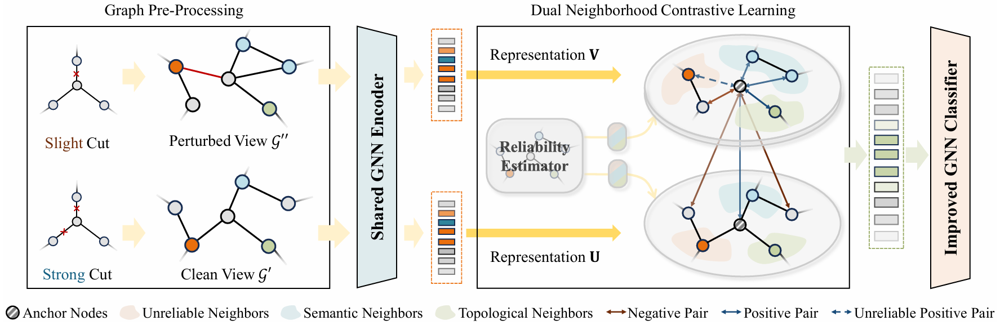

# GRANCE
Implementation of GRANCE in our paper: Refine then Classify: Robust Graph Neural Networks with Reliable Neighborhood Contrastive Refinement, AAAI 2025.
[[Paper]](https://ojs.aaai.org/index.php/AAAI/article/view/33471)



## Requirement
  * Python == 3.8.18
  * PyTorch == 1.10.0+cu111
  * Torch-geometric == 2.4.0
  * Numpy == 1.22.0
  * Scikit-learn == 1.3.2
  * Scipy == 1.10.1
  * Deeprobust == 0.2.9

## Running examples
You only need to run main.py since all configs are set to default values. You can directly switch between different datasets and ptb_rate to run GRANCE by modifying:

 ```
 python main.py --dataset <dataset_name> --ptb_rate <rate>
 ```

## Perturbed Datasets
Our attack datasets follow the Pro-GNN framework. You can directly download the datasets from [[link]](https://github.com/ChandlerBang/Pro-GNN/tree/master/meta). Alternatively, you can generate your own attack datasets using the Deeprobust library. First, install Deeprobust with:
 ```
pip install deeprobust
 ```
Then, generate an attacked graph using:
```
python generate_attack.py --dataset cora --ptb_rate 0.05
```

## Citation
If you find this repo to be useful, please cite our paper. Thank you.
 ```
 @inproceedings{zhuang2025refine,
  title={Refine then Classify: Robust Graph Neural Networks with Reliable Neighborhood Contrastive Refinement},
  author={Zhuang, Shuman and Wu, Zhihao and Chen, Zhaoliang and Dai, Hong-Ning and Liu, Ximeng},
  booktitle={Proceedings of the AAAI Conference on Artificial Intelligence},
  volume={39},
  number={12},
  pages={13473--13482},
  year={2025}
}
 ```
